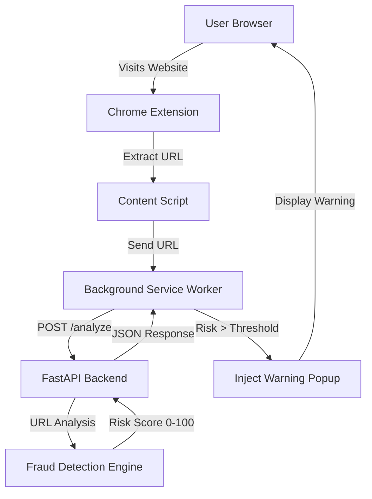

# FraudGuard Implementation Plan

## System Architecture

The FraudGuard system consists of two main modules:

1. **Extension Module** (`extension/`): Chrome browser extension (Manifest v3) that monitors active tabs and displays fraud warnings
2. **Server Module** (`server/`): FastAPI backend service that analyzes URLs and returns fraud risk scores

### Data Flow




## Implementation Phases

### Phase 1: Backend Server Setup

**Files to create:**

- `server/main.py` - FastAPI application entry point
- `server/fraud_detector.py` - Core fraud detection logic
- `server/models.py` - Pydantic models for request/response
- `server/config.py` - Configuration management
- `server/requirements.txt` - Python dependencies
- `server/.env.example` - Environment variables template

**Key Components:**

1. FastAPI app with `/analyze` endpoint that accepts URL and returns risk score
2. Fraud detection engine implementing:

- URL similarity comparison using `difflib.SequenceMatcher` against known bank domains
- Domain age checking (via WHOIS or domain registration APIs)
- HTTPS/SSL certificate validation
- Keyword pattern detection (phishing indicators)
- Risk score calculation (0-100 scale)

3. Optional Azure OpenAI integration for explainable risk reasons
4. CORS configuration to allow extension requests

### Phase 2: Chrome Extension Setup

**Files to create:**

- `extension/manifest.json` - Manifest v3 configuration
- `extension/background.js` - Service worker for API communication
- `extension/content.js` - Content script for URL monitoring and popup injection
- `extension/popup.html` - Extension popup UI (optional)
- `extension/popup.js` - Popup script (optional)
- `extension/styles.css` - Warning popup styling
- `extension/icons/` - Extension icons (16x16, 48x48, 128x128)

**Key Components:**

1. Manifest v3 configuration with:

- Content script permissions
- Background service worker
- Host permissions for all URLs
- Active tab permission

2. Background service worker that:

- Receives URL from content script
- Makes API calls to backend
- Manages fraud detection state

3. Content script that:

- Monitors active tab URL changes
- Sends URLs to background worker
- Injects warning popup when risk threshold exceeded

4. Warning popup UI with:

- Risk classification badge (Safe/Suspicious/Dangerous)
- Fraud score display
- Explanation text
- Action buttons (Exit Site, Report Fraud, Continue)

### Phase 3: Fraud Detection Logic

**Implementation Details:**

1. **URL Similarity Analysis:**

- Maintain list of known legitimate bank/payment domains
- Use `difflib.SequenceMatcher` to compare input URL with legitimate domains
- Calculate similarity ratio (0.0-1.0)
- Flag high similarity with different domain as suspicious

2. **Domain Age Check:**

- Query domain registration date (use free APIs like whoisxmlapi.com or similar)
- Flag domains registered < 6 months as suspicious
- Flag domains registered < 1 month as high risk

3. **HTTPS/SSL Validation:**

- Verify SSL certificate validity
- Check certificate issuer
- Flag self-signed or invalid certificates

4. **Keyword Pattern Detection:**

- Scan URL and page content for phishing keywords
- Patterns: "secure-login", "verify-account", "update-info", etc.
- Weight based on keyword frequency and context

5. **Risk Score Calculation:**

- Combine all signals with weighted scoring
- Output: 0-100 score with classification:
    - 0-30: Safe
    - 31-70: Suspicious
    - 71-100: Dangerous

### Phase 4: UI/UX Implementation

**Warning Popup Design:**

- Fixed position overlay (z-index: 999999)
- Color-coded by risk level:
- Green: Safe
- Yellow: Suspicious
- Red: Dangerous
- Non-intrusive but visible design
- Smooth animations for appearance
- Responsive layout

### Phase 5: Testing & Integration

**Testing Strategy:**

1. Unit tests for fraud detection logic
2. Integration tests for API endpoints
3. Manual testing with sample phishing URLs
4. Extension testing in Chrome browser
5. End-to-end flow validation

### Phase 6: Azure Deployment (Optional)

**Deployment Steps:**

1. Create Azure App Service
2. Configure environment variables
3. Deploy FastAPI application
4. Update extension to use production API URL
5. Configure CORS for production domain

## File Structure

```javascript
FinFluence/
├── extension/
│   ├── manifest.json
│   ├── background.js
│   ├── content.js
│   ├── popup.html
│   ├── popup.js
│   ├── styles.css
│   └── icons/
│       ├── icon16.png
│       ├── icon48.png
│       └── icon128.png
├── server/
│   ├── main.py
│   ├── fraud_detector.py
│   ├── models.py
│   ├── config.py
│   ├── requirements.txt
│   └── .env.example
├── README.md
├── System_Architecture.md
└── SystemPlan.md
```


## Dependencies

**Backend (Python):**

- fastapi
- uvicorn
- pydantic
- requests
- python-whois (or alternative)
- openai (for Azure OpenAI integration)

**Extension (JavaScript):**

- No external dependencies (vanilla JavaScript)

## Configuration

**Backend Environment Variables:**

- `BACKEND_URL` - Backend API URL
- `AZURE_OPENAI_ENDPOINT` (optional) - Azure OpenAI endpoint
- `AZURE_OPENAI_KEY` (optional) - Azure OpenAI API key
- `AZURE_OPENAI_DEPLOYMENT` (optional) - Model deployment name

**Extension Configuration:**

- Backend API URL (hardcoded or configurable in manifest)

## Risk Thresholds

- **Safe**: Score 0-30 (no popup)
- **Suspicious**: Score 31-70 (optional warning)
- **Dangerous**: Score 71-100 (mandatory warning popup)

## Future Enhancements (Out of MVP Scope)